<p align="center">
  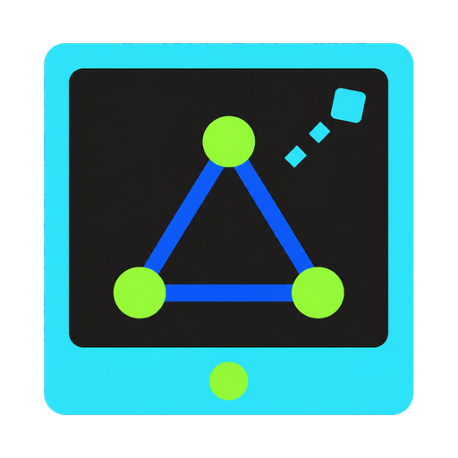
</p>

<h1 align="center">DeskOS MeshCore</h1>

<p align="center"><strong>A bright, touch-first MeshCore desk for the SenseCAP Indicator D1L.</strong></p>

DeskOS **1.7.6** is the current full-feature production firmware for the
SenseCAP Indicator D1L. Download `v1.7.6` from the
[GitHub release](https://github.com/n30nex/DeskOS-MeshCore/releases/tag/v1.7.6).
The Actions release is compiled with the immutable `full_feature` profile and
`conditional` SD history mode.

DeskOS is a standalone, dark, touch-first MeshCore client. Firmware is built
and packaged by GitHub Actions. The release provides the ESP32 update and
full-clean images, the complete RP2040 SD-bridge UF2, checksums, a signed local
update bundle, and end-user instructions.

## What 1.7.6 fixes

DeskOS 1.7.6 completes the first-install path and makes local time practical:

- the [NeonPocket flasher](https://flasher.canadaverse.org/) can identify the
  RP2040 BOOTSEL drive, checksum the matching bridge UF2, and copy it directly;
- the flasher can prepare an already-formatted FAT32 card by adding only
  missing, checksum-verified DeskOS files. It never formats, deletes, or
  replaces a different existing file;
- both bridge and card steps include a separate device-side verification so a
  copied file is never presented as a working installation; and
- **Settings -> Display** now has **Time -1h** and **Time +1h** controls for the
  displayed local clock. Mountain Time is UTC-7 in standard time and UTC-6 in
  daylight time; daylight-saving changes are manual.

Radio, security, and retained protocol timestamps remain UTC.

## What 1.7.5 improved

DeskOS 1.7.5 makes remote repeater work and everyday display use more reliable:

- repeater and room login always uses flood delivery, so servers beyond direct
  range can receive the sign-in request through the mesh;
- **Close** on Status, Telemetry, Neighbours, and other signed-in pages returns
  to the repeater manager instead of dropping back to Contacts;
- Neighbours shows saved repeater names, friendly elapsed time, and SNR while
  retaining a short identity prefix for unknown entries;
- the screen now locks and turns off after ten minutes of inactivity, with a
  true full-screen cover that cannot leave old controls visible above it;
- the top button wakes the display; double-pressing it while awake sends one
  normal advert; and
- maps already stored on the SD card render without an artificial delay between
  tiles.

## What 1.7.1 added

Repeater and room management now behaves like a first-class touch workflow:

- saved repeater and room contacts have a direct **Login** button;
- login opens a large masked password field and on-screen keyboard;
- passwords can be remembered per server on this D1L, forgotten at any time,
  and are removed with the contact or a factory reset;
- successful login opens a dedicated command grid for Status, Telemetry,
  Neighbours, Access, Tools, Room, and Console functions as permitted;
- requests show an animated working screen, timeout guidance, and persistent
  results instead of disappearing into a queued toast; and
- server changes still require local confirmation and verified replies.

## What 1.7 adds

DeskOS 1.7 gives the firmware a clear identity inspired by the bright visual
family of [NeonPocketMC](https://github.com/n30nex/NeonPocketMC):

- a new DeskOS touch-display and three-node mesh mark;
- a smooth, non-blocking 3.2-second opening animation;
- electric cyan, cobalt, neon lime, and charcoal across the complete UI;
- simpler opening messages that describe what is actually on screen; and
- matching repository artwork and interface previews.

<p align="center">
  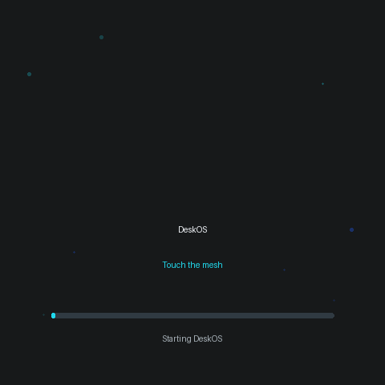
</p>

The animation above is generated from the same bounded timeline as the
firmware. The on-device scene is drawn with lightweight LVGL shapes rather
than storing a large bitmap in flash.

## Everyday improvements from 1.6

DeskOS 1.6 keeps the complete 1.5 feature set and refines the everyday touch
experience:

- a compact Home dashboard with an always-visible lock control and live time;
- directly reachable Contacts search plus Recent, Favorites, A-Z, Role, and
  Signal sort modes;
- clearer, shorter labels and consistent 44 px touch targets across Contacts,
  radio, Wi-Fi, diagnostics, and messaging;
- truthful full-feature BLE and diagnostics states in the release simulator;
- safer visual semantics so advanced actions no longer look like failures; and
- an owned Contacts sorting/search model extracted from the main UI controller.

DeskOS 1.5 previously added:

- secure BLE companion pairing, bonding, reconnect, disconnect, and forget;
- the current MeshCore companion protocol over an encrypted BLE transport;
- deliberate one-time contact and channel QR sharing with public data only;
- Ed25519-signed local SD updates, inactive-slot installation, anti-downgrade
  sequencing, first-boot confirmation, and automatic rollback;
- expanded bounded diagnostics, event history, display preferences, and
  notification controls; and
- the corrected channel, Contacts, Finder, Ping, PATH, TRACE, Map, Wi-Fi,
  storage, administration, Observer/MQTT, and messaging workflows from 1.2.

DeskOS is a non-forwarding client. It sends user-requested traffic but does not
repeat other devices' traffic. Its conditional SD-primary retained history
becomes visibly live-only when storage is missing; history is never silently
redirected into default NVS.

## Security boundaries

- BLE requires Secure Connections, MITM protection, encryption,
  authentication, bonding, and an explicit notification subscription before
  the companion protocol becomes ready.
- BLE cannot export or import private keys, factory-reset the device, or reboot
  it remotely.
- QR codes contain only the public contact or channel material selected by the
  owner. Their temporary URI buffer is cleared after rendering.
- Signed updates are read from local SD, verified before the inactive slot is
  written, and require two deliberate on-device confirmations.
- USB remains the recovery path. DeskOS never formats the user's SD card.

See the [user guide](docs/USER_GUIDE_D1L.md),
[known limitations](docs/KNOWN_LIMITATIONS.md), and
[companion security/protocol notes](docs/COMPANION_3BYTE_COMPATIBILITY.md).

## Release train

| Release | Purpose | State |
|---|---|---|
| **1.0 / RC1** | Initial production baseline | Historical |
| **1.2 / RC2** | Channel, Contacts, parity, packaging, and screenshot correction | Historical (`v1.2.0`) |
| **1.5 / RC3** | BLE, signed update/rollback, sharing, diagnostics, and full-feature activation | Historical (`v1.5.0`) |
| **1.6** | Compact Home, Contacts search/sorts, UI truthfulness, and diagnostics polish | Historical (`v1.6.0`) |
| **1.7** | DeskOS identity, animated opening, and NeonPocket-inspired product theme | Historical (`v1.7.0`) |
| **1.7.1** | Direct repeater login, saved passwords, and touch-first server management | Historical (`v1.7.1`) |
| **1.7.5** | Reliable remote login, better results/navigation, display wake/lock, and faster cached maps | Historical (`v1.7.5`) |
| **1.7.6** | Guided bridge/SD installation and adjustable local display time | Current (`v1.7.6`) |

## Device UI

### Physical 1.7.5 device captures

These current 480x480 frames came directly from the physically flashed D1L.
Their CRCs, firmware identity, safety receipt, and collection notes are in
[`docs/screenshots/device-1.7.5/README.md`](docs/screenshots/device-1.7.5/README.md).

| Home | Channels |
|---|---|
| 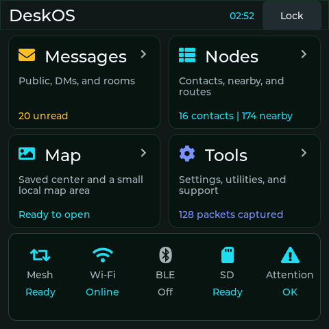 | 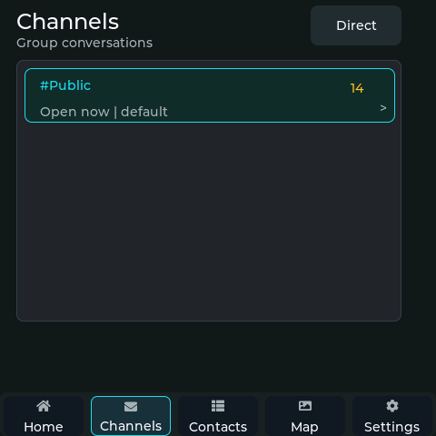 |

| Contacts | Settings |
|---|---|
| 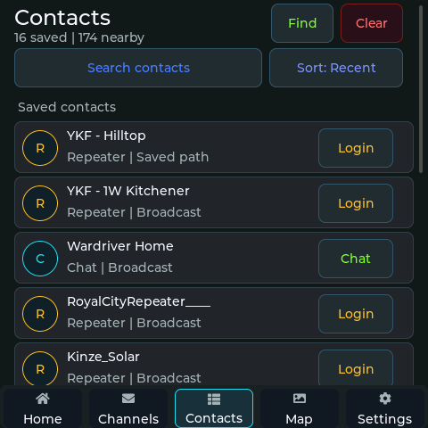 | 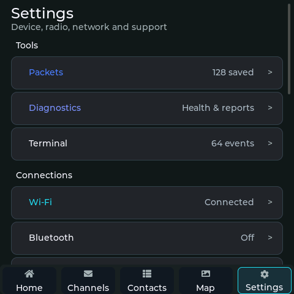 |

The screenshots contain no private messages, passwords, keys, or precise
location data. Collection transmitted no public RF traffic and never formatted
the SD card.

### Repeater management in 1.7.5

Managed repeaters and rooms now open directly from their **Login** button.
After authentication, each server gets a focused command dashboard instead of
mixing administration into the contact page. Slow mesh requests remain visible
until they succeed, fail, time out, or are cancelled.

| Login | Working |
|---|---|
| 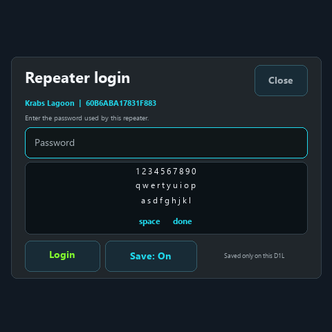 | 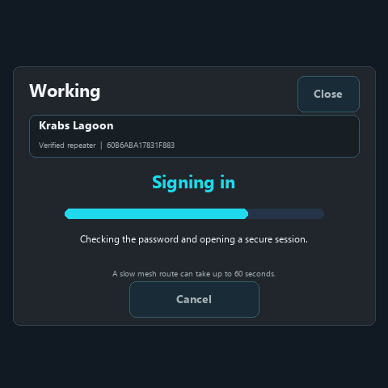 |

| Manager | Status |
|---|---|
| 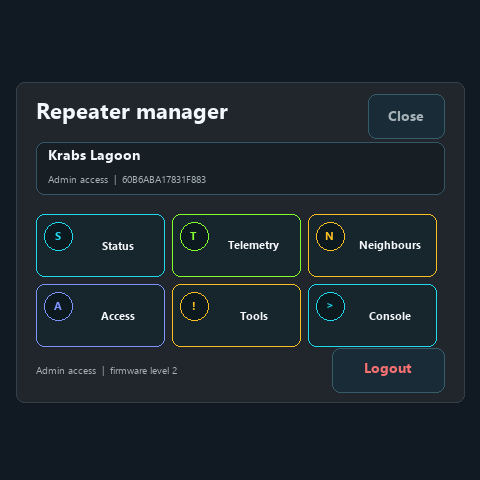 | 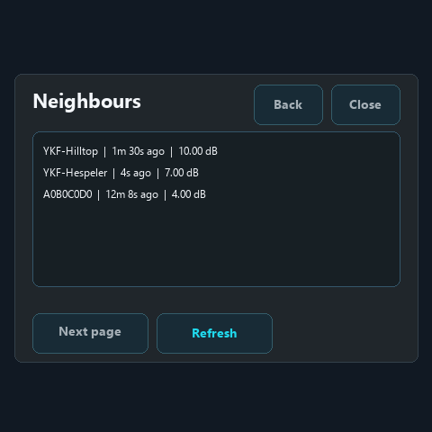 |

These are deterministic 480x480 simulator previews used for layout regression.
They contain no real password or private radio material.

The 1.7 simulator previews below show the refreshed production palette. They
are visual previews, not substitutes for the physical D1L release check.

| Home | Channels |
|---|---|
| 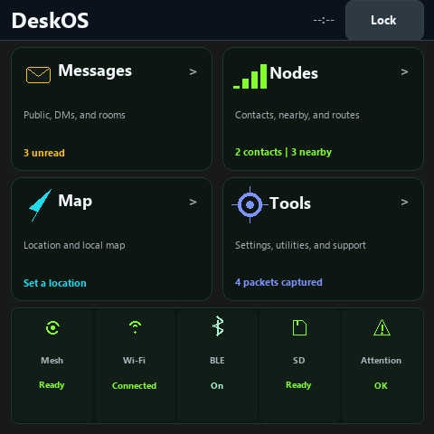 | 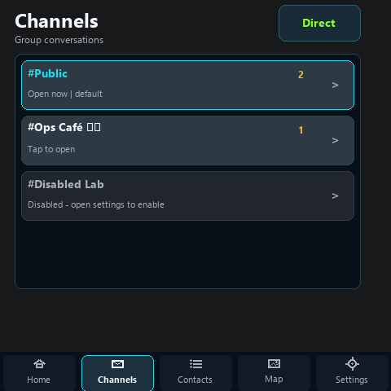 |

| Contacts | Settings |
|---|---|
| 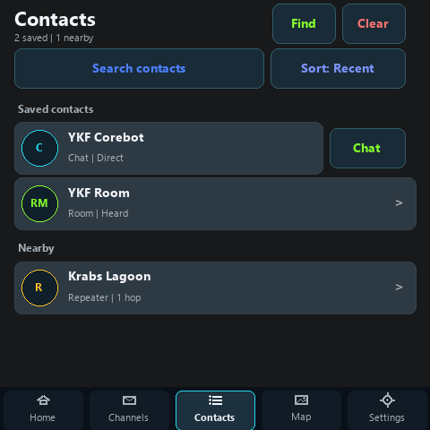 | 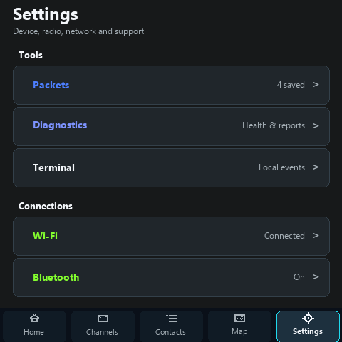 |

### Physical 1.2 reference captures

| Home | Channels |
|---|---|
| 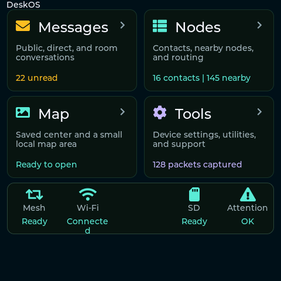 | 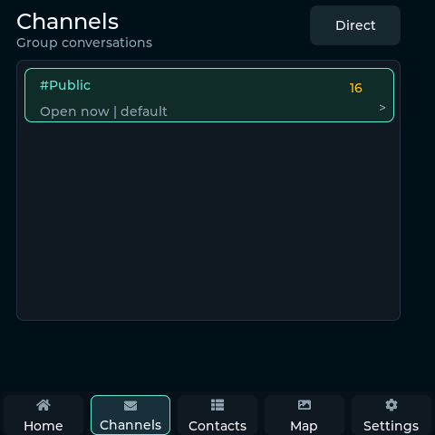 |

| Contacts | Settings |
|---|---|
| 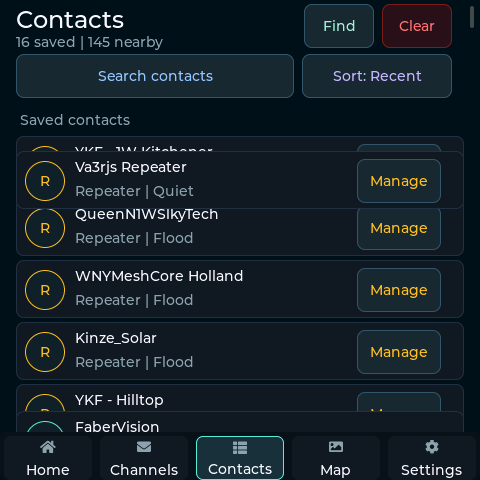 | 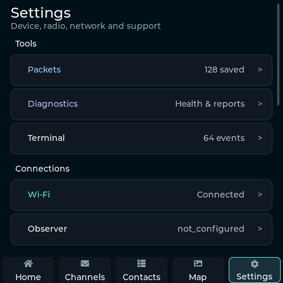 |

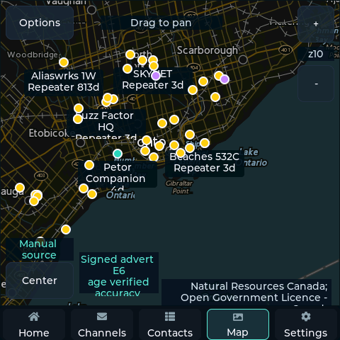

Locations and public node labels may be visible. Private messages, passwords,
private keys, and admin credentials must never be included in screenshots.

## Install

Use the [browser flasher](https://flasher.canadaverse.org/) for the guided
ESP32, RP2040 bridge, and SD-card workflow, or extract the complete release
package and begin with `START_HERE.md`.

- **Update an existing DeskOS install:** use the app update path. It preserves
  unrelated retained flash regions.
- **Fresh clean install or recovery:** use the full 8 MB image at `0x0`.
- **RP2040 bridge:** hold BOOTSEL while connecting its USB side, then use the
  browser flasher to identify the drive and copy the verified production UF2.
- **SD card:** select an already-formatted FAT32 card in the browser flasher.
  It adds and reads back only the missing DeskOS payload; it never formats the
  card or replaces a different file.
- **On-device signed update:** place the exact manifest, signature, and app BIN
  from one release under `updates/` on the prepared SD card, then use
  **Settings -> Signed Update**.

On Linux, only the stable D1L identity is supported for flashing:

```text
/dev/serial/by-id/usb-1a86_USB_Serial-if00-port0
VID:PID 1a86:7523
```

Never substitute a guessed `/dev/ttyUSB*` path. The firmware never formats an
SD card.
